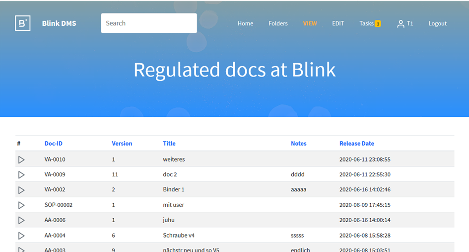
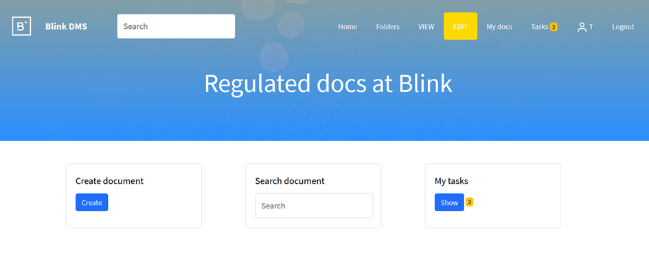
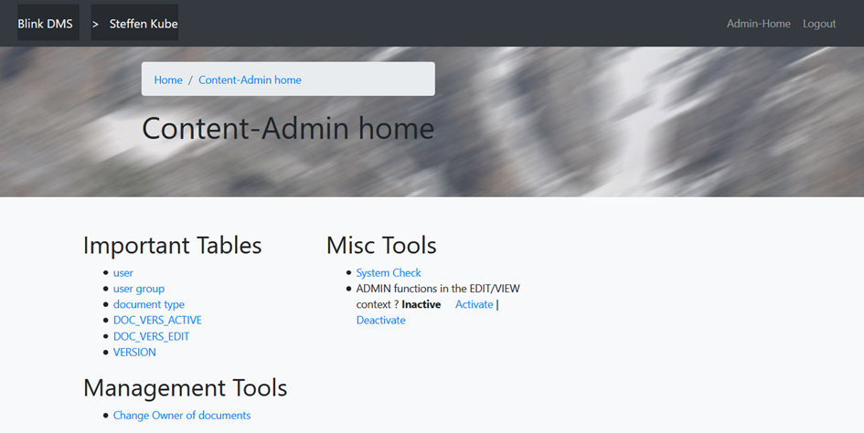

User’s Guide
============





|home_scr_view.png|

Role system
-----------

Following roles are available:
  * Editor (can create, edit, review, release documents)
  * Viewer (can view documents)
  * Admin (can do, what an editor can do + create/edit users, create root folders)
  * Folder.Edit (can create, edit folders)
  * QM (FUTURE: can release documents)
  
First steps
-----------

Root actions
````````````

  * go to table "document type"
  * create a new document type, e.g. "Order form"
  * create a new user for yourself with the role "Editor", "Folder.Edit" and "Admin"
  * now you can create new users and documents with your personal account
  * logout
  
Create a new document
`````````````````````

  * login as normal user
  * activate the EDIT area (see head menu)
  * click "Create document"
  * select/create a destination folder
  * select the document type and give a title
  * now the document object is created
  * upload documents, add reviewers, add links
  
Start a release process
```````````````````````

  * the owner of the document can start a release workflow
  * go to the document
  * click  "Start Release Workflow" 
  * now the document cannot be edited anymore, but the workflow can be rejected by you
  
  * now the other reviewrs/releasers can login and do their review process
  * the last reviewer automatically releases the document
  * if configured in the "document type", define the original Word document will be converted to to PDF
    (see `Convert Word documents to PDF`_. )
  * the document is now visible in the VIEW area
  
Areas
-----

EDIT area
`````````

|home_scr_edit.png|


Scope:
  * allow create/modification of documents
  * allow creation/modification of folders
  * allow linking of documents to folders
  * see your active tasks
  * do reviews
  
VIEW area
````````` 
|home_scr_view.png|

Scope:
  * allow search/retrieve released documents
  
Admin area
``````````

|home_scr_admin.png|

**Main functions:**

  * Create/modify users
  * Create/modify document types
  * Do a system check
  * Activate/deactive admin functions in the normal user context GUI
  * Reject any active workflows
  * Change Owners of documents
  
**User management**

Useful activities:
  * Set login method=LDAP to activate ActiveDirectory authorization
  * Set “user is active“=0 to deactivate a user
  * Set roles to allow user activities
  * Set password
  
**document type management**

Useful activities:
  * create new document types
  * define the "Doc code" : this is the prefix for the "Document ID"
  * define "Covert Word document to PDF" yes or no : automatically convert a \*.docx document to PDF at the end of the document release;
    the users in the VIEW area just see the produced PDF document; the Word doc must contain VARIABLES, which will be replaced 
    by the database data, like title, Document-ID, version and so on
  

**System Configuration**

some important config in conf/config.py:
  * workflow.sign.password.need : 0 or 1 : defines if the user must give the password on an approval workflow (electronic signature support)
    this is required by FDA CFR820 Part11
  * email.send.allow : 0 or 1 : defines, if the system should send emails to the users, mainly in the workflow process
  
Scenarios
---------

Start Approval-Workflow (A04)
`````````````````````````````

Prerequisites: 

Following users are planned for approval:
  * test1 (editor of the document)
  * test2 (reviewer1)
  * test3 (reviewer2)
  * test4 (releaser1)
  * test5 (releaser2)
    
Actions:
  * Start Workflow
  * if email-function is active on the system: All REVIEW-users get an email, the system allows them to review the document version
  * The review-users review
  * After last reviewer: all releasers get an email
  * All releasers do a review


Convert Word documents to PDF
`````````````````````````````
What to keep in mind:
  * there is an example for a proper WOrd template: see [GIT-PROJ]/doc/examples/Template_SOP_v1.docx
  * the PDF conversions takes places at the end of the release process
  * a VIEWER can only retrieve the PDF version, not the Word-version